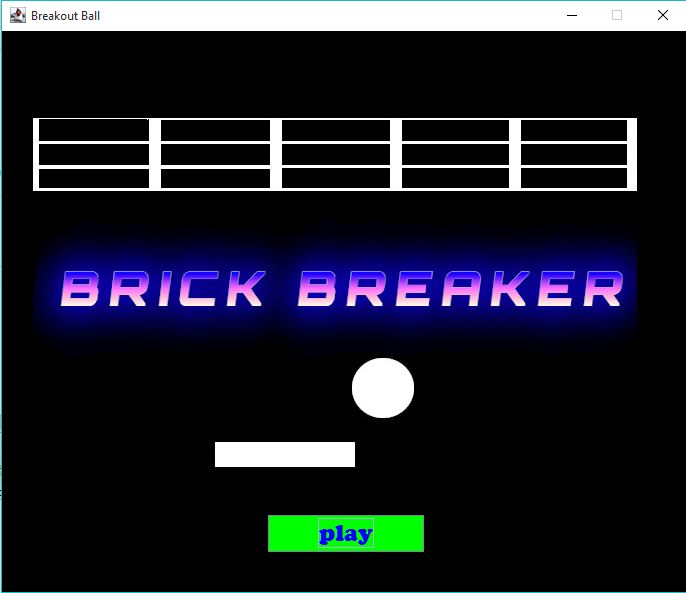
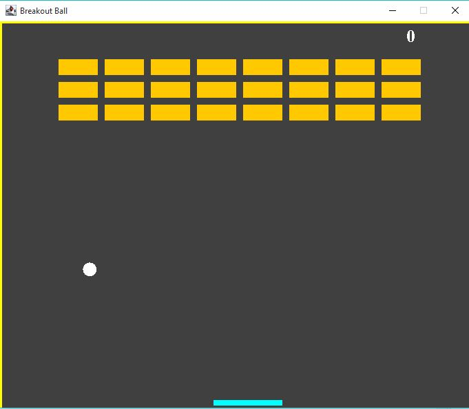
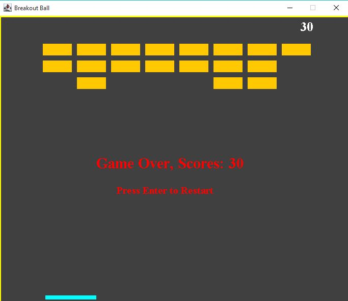

# Brick Breaker Game

A classic Brick Breaker game developed in Java using Object-Oriented Programming principles as a final project for the OOP course.

## 🎮 Game Features

- **Classic Gameplay**: Control a paddle to bounce a ball and break bricks
- **Score System**: Earn points for each brick destroyed
- **Collision Detection**: Realistic ball physics with wall and paddle bouncing
- **Game States**: Win condition when all bricks are destroyed, lose when ball falls below paddle
- **Restart Functionality**: Press Enter to restart the game

## 📸 Screenshots







## 🎯 Controls

- **Left Arrow**: Move paddle left
- **Right Arrow**: Move paddle right
- **Enter**: Start/Restart game

## 🏗️ Project Structure

```text
src/brickBracker/
├── Main.java          # Entry point - creates game window
├── Gameplay.java      # Main game logic and rendering
└── MapGenerator.java  # Brick layout generation and management
```

## 🎨 OOP Concepts Implemented

- **Inheritance**: `Gameplay` extends `JPanel` and implements `KeyListener`, `ActionListener`
- **Encapsulation**: Private fields with public methods for controlled access
- **Abstraction**: Separate classes for different game components
- **Polymorphism**: Interface implementations for event handling

## 🚀 How to Run

1. Compile the Java files:


   ```bash
   javac src/brickBracker/*.java
   ```


2. Run the game:


   ```bash
   java -cp src brickBracker.Main
   ```


## 📋 Requirements

- Java 8 or higher
- Swing/AWT libraries (included in JDK)

## 🎓 Academic Context

This project was developed as the final assignment for the Object-Oriented Programming course during the second semester of the first year in the Bachelor of Science in Computer Science program.
